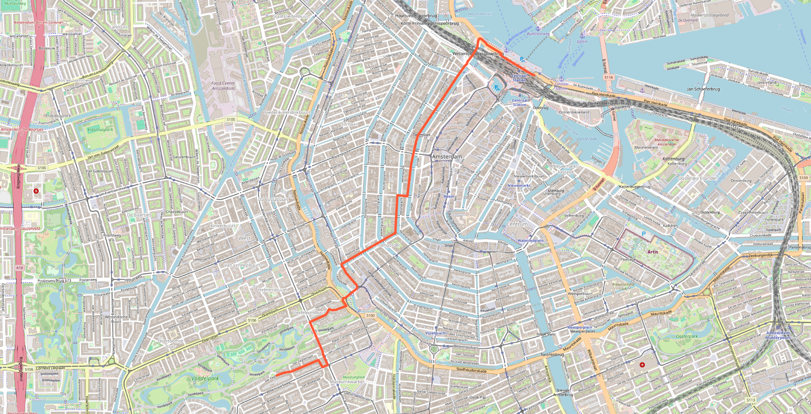

# Week 1 demos

Screenshots from the end-of-Week-1 working build. The map canvas is captured directly via `window.scootermaps.saveMapScreenshot(name)` (uses `getCanvas().toDataURL()` and posts to the backend `/screenshot` endpoint).

## 01 — Centraal Station → Vondelpark, snorfiets



- **From**: Amsterdam Centraal (52.3791, 4.9003)
- **To**: Vondelpark south entrance (52.3576, 4.8722)
- **Profile**: snorfiets (blauw kenteken · 25 km/h cap · road-only since 2019)
- **Result**: 4.45 km · 11 min

A classic across-the-city snorfiets trip. The route stays on roads — no fietspad shortcuts through Vondelpark or along the Singel.

## Adding more demos

Render any route from the dev console:

```js
await window.scootermaps.drawRouteForDemo(fromLat, fromLon, toLat, toLon, 'snorfiets')
await window.scootermaps.saveMapScreenshot('NN_short_descriptive_name')
```

The PNG lands here automatically.
